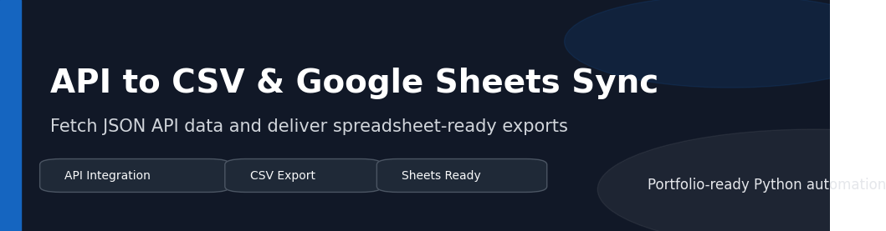
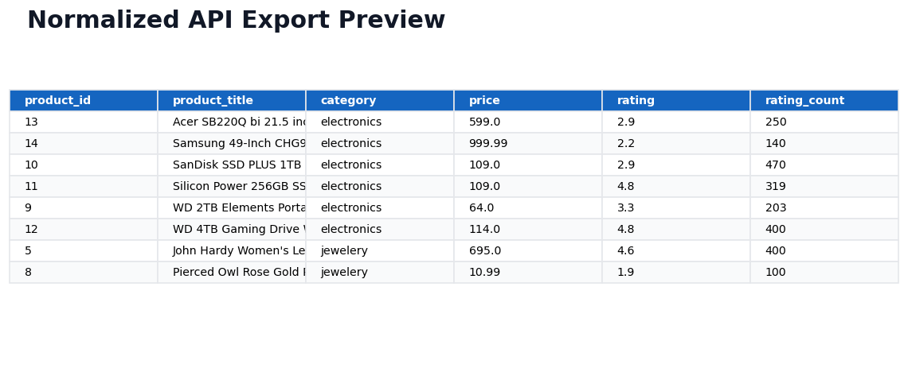

# API to CSV & Google Sheets Sync




Client-style API integration project for businesses that need data pulled from an external API and converted into a clean spreadsheet-ready format.

The default demo fetches product records from the public Fake Store API, flattens nested JSON fields, exports a normalized CSV, and includes an optional Google Sheets sync path for service-account workflows.

## Visual Preview



| Asset | Link |
| --- | --- |
| Architecture diagram | [docs/architecture.md](docs/architecture.md) |
| Workflow diagram | [docs/workflow.md](docs/workflow.md) |
| Sample output guide | [docs/sample_outputs.md](docs/sample_outputs.md) |
| Client delivery notes | [docs/client_delivery_notes.md](docs/client_delivery_notes.md) |

## Client Problem

Businesses often receive operational data from APIs, vendor catalogs, ecommerce systems, CRM tools, or inventory platforms. The data is useful, but it usually arrives as nested JSON that is not ready for spreadsheet review or reporting.

This project demonstrates a reusable pattern for turning API data into a clean CSV or Google Sheet.

## Delivered Solution

- Public API request workflow with configurable endpoint and timeout
- JSON normalization using `pandas`
- Clean spreadsheet-ready CSV export
- Optional Google Sheets sync using `gspread`
- `.env.example` for safe credential setup
- Logging and error handling for handoff
- PowerShell-friendly CLI commands

## Project Structure

```text
api-to-csv-google-sheets-sync/
  main.py
  requirements.txt
  README.md
  portfolio_description.md
  docs/
    architecture.md
    workflow.md
    sample_outputs.md
    client_delivery_notes.md
  assets/
    banner.png
    architecture_diagram.png
    workflow_diagram.png
  output/
    api_data.csv
  screenshots/
    sample_output_preview.png
  .env.example
```

## Setup

```powershell
python -m venv .venv
.\.venv\Scripts\Activate.ps1
pip install -r requirements.txt
```

If running from the repository root, install the shared dependency file:

```powershell
pip install -r requirements.txt
```

## Usage

Run the default API export:

```powershell
python main.py
```

Use a custom endpoint:

```powershell
python main.py --endpoint "https://fakestoreapi.com/products" --output "output/api_data.csv"
```

Use local proxy settings only when your network requires them:

```powershell
python main.py --use-system-proxy
```

Optional Google Sheets sync:

```powershell
copy .env.example .env
# Edit .env and set GOOGLE_APPLICATION_CREDENTIALS
python main.py --sync-google-sheets --sheet-name "API Product Export"
```

## Outputs

```text
output/api_data.csv
output/run.log
```

CSV columns:

| Column | Description |
| --- | --- |
| `product_id` | Source product ID |
| `product_title` | Product name |
| `category` | Product category |
| `price` | Numeric product price |
| `rating` | Average product rating |
| `rating_count` | Rating count |
| `description` | Cleaned product description |
| `image_url` | Product image URL |

## Validation

```powershell
python -m py_compile main.py
python main.py
```

Successful run criteria:

- API request completes
- CSV file is exported to `output/api_data.csv`
- Output includes normalized columns
- Runtime log reports the exported row count

## Adapting This for Client Work

This pattern can be adapted for:

- Shopify products, orders, and customers
- Airtable records
- CRM contacts and deals
- Vendor catalogs
- Inventory feeds
- Lead enrichment APIs
- Order management systems

For authenticated APIs, credentials should be loaded from `.env` and never committed to GitHub.

## Security and Credentials

The default demo requires no API key. Google Sheets sync uses a service-account JSON path through `GOOGLE_APPLICATION_CREDENTIALS`. Do not commit `.env` or real service-account files.

## Known Limits

- The included normalizer targets product-style API records.
- Pagination is not implemented in the demo version.
- Google Sheets sync requires a pre-created sheet shared with the service account.

## Upgrade Ideas

- API pagination support
- Incremental sync by updated date
- Retry/backoff policy
- Authenticated API headers
- Scheduled runs
- Slack or email notifications
