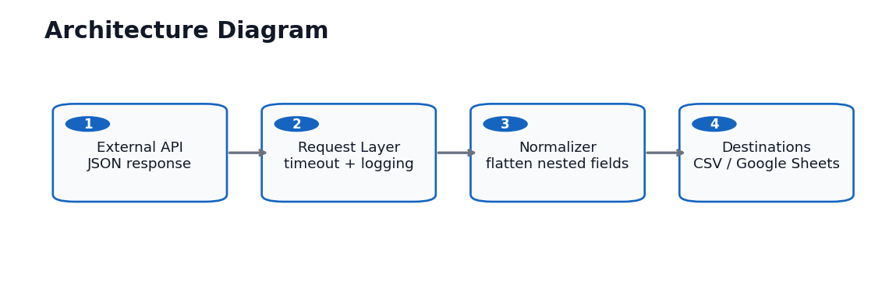
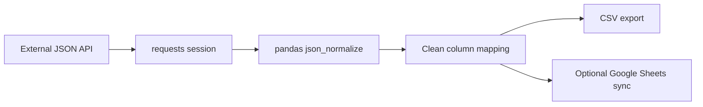

# Architecture Diagram

## Components

| Layer | Responsibility |
| --- | --- |
| External API | Provides JSON records from a public or authenticated endpoint |
| Request layer | Handles endpoint configuration, timeout, proxy option, and response validation |
| Normalizer | Flattens nested JSON fields into spreadsheet-ready columns |
| Output layer | Exports CSV and optionally syncs rows to Google Sheets |

## Data Flow

## Client Notes

This design is easy to adapt for Shopify, Airtable, CRM, inventory, vendor catalog, or lead enrichment APIs by changing the endpoint, authentication, and field mapping.
