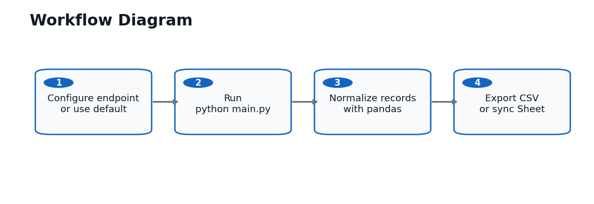

# Workflow Diagram



## Operator Workflow

1. Configure an endpoint or use the included public API default.
2. Run `python main.py`.
3. The script fetches JSON data and normalizes nested fields.
4. The script exports `output/api_data.csv` or syncs to Google Sheets when enabled.

## Commands

```powershell
python main.py
python main.py --endpoint "https://fakestoreapi.com/products" --output "output/api_data.csv"
```

Optional Google Sheets sync:

```powershell
python main.py --sync-google-sheets --sheet-name "API Product Export"
```

## Handoff Checklist

- Confirm whether the client API needs authentication.
- Confirm pagination and rate-limit behavior.
- Confirm the final column mapping.
- Never commit `.env` or service-account JSON credentials.
